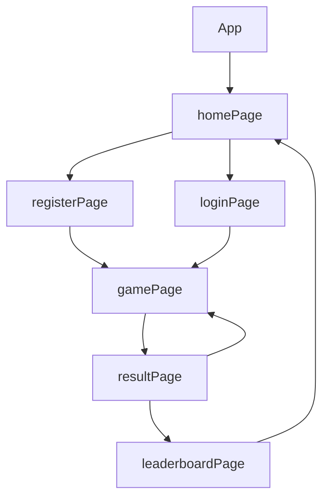

> 💻 PROJECT CODE ⭐⭐⭐
<h1>✨cheerful-notebook-6741✨</h1>

> 💻 PROJECT NAME ⭐⭐⭐ 
<h1>💫WILD TIMES💫</h1>
<br/>

[](https://github.com/swati082001/games-backend)
[](https://shy-blue-elk-hem.cyclic.app/)
[](https://wildtimes-swati082001.vercel.app/)


## OBJECTIVE✨

> Wild Times is a real time full stack single player game. This game is build with the help of MERN Stack, also incorporating dynamic animation to create an immersive gaming experience.

---

## DESCRIPTION✨

- The game features players to earn points and also increase their ranks in the leaderboard, and earn rewards as they progress through the levels. Wild Times even features real time chat, leaderboard and achievements to enhance their social aspects.

- The repo includes both client-side and server-side.

---

## RUN the Game✨

1. Clone this repository.
2. Open the terminal and navigate to the folder.
3. Run the following command to install dependencies:

  ```
  npm install
  ```

4. Run the following command to run the game:

  ```
  npm run dev
  ```

5. Enjoy!

---

## TECH-STACK💫

- #### For Frontend :

  - `HTML5`
  - `CSS3`
  - `JavaScript`
  - `ReactJS`
  - `TypeScript`

- #### For Backend :

  - `NodeJS`
  - `ExpressJS`
  - `MongoDB `

- #### For Styling :

  - `Chakra UI `
  - `CSS-Animations`

- #### For deploying database :

  - `cyclic `

- #### For live Project : -
  - `vercel`

---

## FEATURES✨

| Serial No | Feature                                                                           |
| --------- | --------------------------------------------------------------------------------- |
| 1         | User signup, User Login                                                           |
| 2         | Able to play the game                                                             |
| 3         | Able to see the score                                                             |
| 4         | Dynamic Leaderboard                                                               |

---

# package.json(Dependency)✨

| Serial No | Backend      | Frontend                     |
| --------- | ------------ | ---------------------------- |
| 1         | bcrypt       | chakra-ui                    |
| 2         | mongoose     | react-router-dom             |
| 3         | cors         | react-icons                  |
| 4         | dotenv       | axios                        |
| 5         | express      | typescript                   |
| 6         | jsonwebtoken | react-simple-chatbot         |

---

## Flow✨



## Creators Profile Links✨

| Creators                 | Github                                                                                                                                    | Linkedin                                                                                                                                                            | Portfolio                                                                                                                                     |
| ----------------------------- | ----------------------------------------------------------------------------------------------------------------------------------------- | ------------------------------------------------------------------------------------------------------------------------------------------------------------------- | --------------------------------------------------------------------------------------------------------------------------------------------- |
| Sarfraj Ahmad Raza | [](https://github.com/sarfraj0304) | [](https://www.linkedin.com/in/sarfrajahmadraza/) | [](https://sarfraj0304.github.io/)  |
| Monojit Mondal | [](https://github.com/ninja-mono1696) | [](https://www.linkedin.com/in/monojit1696/)  | [](http://ninja-mono1696.github.io/) |
| Swati Sucharita Mohanty | [](https://github.com/swati082001) | [](https://linkedin.com/in/swati-mohanty08) | [](https://swati082001.github.io/)     |
| Ujjawal Kumar | [](https://github.com/ujjawal0203) | [](https://www.linkedin.com/in/ujjawal-kumar-086691237/) | [](https://ujjawal0203.github.io/)  |

---

## Screenshots 📷
---


# HOME-PAGE
  - Home page includes the title of the game (WILD TIMES) along with the feature to register a new user or to login an existing user, connected with the backend. After the login or registration is successfull, the player will be able to select a theme based on his/her choice and get notified with the help of a 'toast', and will be directly navigated to the 'Gaming Page'.

  

  

  

# GAME-PAGE
  - As per the theming of the game page there are two themes
    - Squid Pro : The player will get a real time experience of the squid game with player dodging the bomb obstacles and reaching the goal to earn points.
    - Snow man : The player will get a real time experience of a snow blizzard with snow-man dodging the fire obstacles and reaching the goal to earn points.

  - HOW TO PLAY :
    - On pressing of the mouse button the player will move forward and on releasing the mouse button the player will stop.
    - The speed of the obstacles keeps on increasing as the player move forward.
    - The player has to save himself/herself from the obstacles to reach the goal.
    - If the player gets touched with any obstacles, the game is over.

  

  

  

# RESULT-PAGE
  - After the game ends the scores will be shown on this page.

  

# LEADERBOARD
  - The ranking of all the players registered with us will be shown here with their all time scores and level they have crossed.

  

---

## Reference✨

- [MDN DOCS](https://developer.mozilla.org/en-US/docs/Web/API/Canvas_API/Tutorial/Using_images)
- [Framer Motion](https://www.framer.com/motion/)

---

<h1 align="center">✨Thank You✨</h1>
